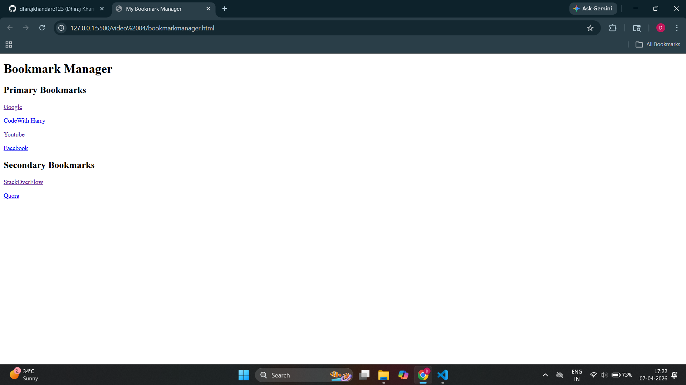

# 📘 HTML Basics: Headings, Paragraphs, and Anchor Tags

## 📌 Introduction
HTML (HyperText Markup Language) is used to create web pages. It structures content using elements like headings, paragraphs, and links.

---

## 🧾 Headings in HTML
HTML provides six levels of headings, from `<h1>` (largest) to `<h6>` (smallest).

### Example:

<h1>This is Heading 1</h1>
<h2>This is Heading 2</h2>
<h3>This is Heading 3</h3>
<h4>This is Heading 4</h4>
<h5>This is Heading 5</h5>
<h6>This is Heading 6</h6>

## 📄 Paragraphs in HTML

This is a paragraph.

This is another paragraph.

Paragraphs are defined using the 
 tag.

## 🔗 Anchor Tag (Links) in HTML

The <a> tag is used to create hyperlinks.

<a href="URL">Link Text</a>

<a href="https://www.google.com" target="_blank">Open Google</a>

# Bookmarks Manager

